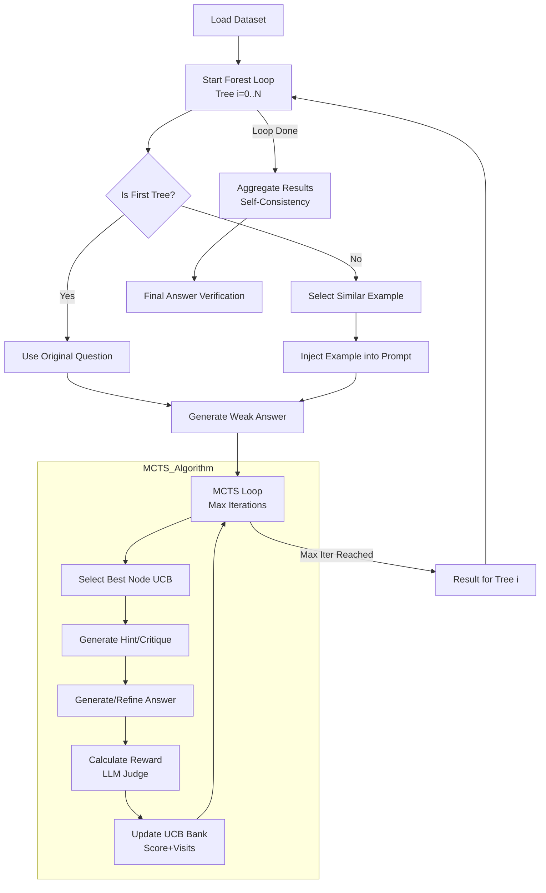

## Overview

```mermaid
graph TD
    A[Load Dataset] --> B[Start Forest Loop<br>Tree i=0..N]
    B --> C{Is First Tree?}
    C -->|Yes| D[Use Original Question]
    C -->|No| E[Select Similar Example]
    E --> F[Inject Example into Prompt]
    D --> G[Generate Weak Answer]
    F --> G
    G --> H[MCTS Loop<br>Max Iterations]
    subgraph MCTS_Algorithm
        H --> M1[Select Best Node UCB]
        M1 --> M2[Generate Hint/Critique]
        M2 --> M3[Generate/Refine Answer]
        M3 --> M4[Calculate Reward<br>LLM Judge]
        M4 --> M5[Update UCB Bank<br>Score+Visits]
        M5 --> H
    end
    H -->|Max Iter Reached| I[Result for Tree i]
    I --> B
    B -->|Loop Done| J[Aggregate Results<br>Self-Consistency]
    J --> K[Final Answer Verification]
```