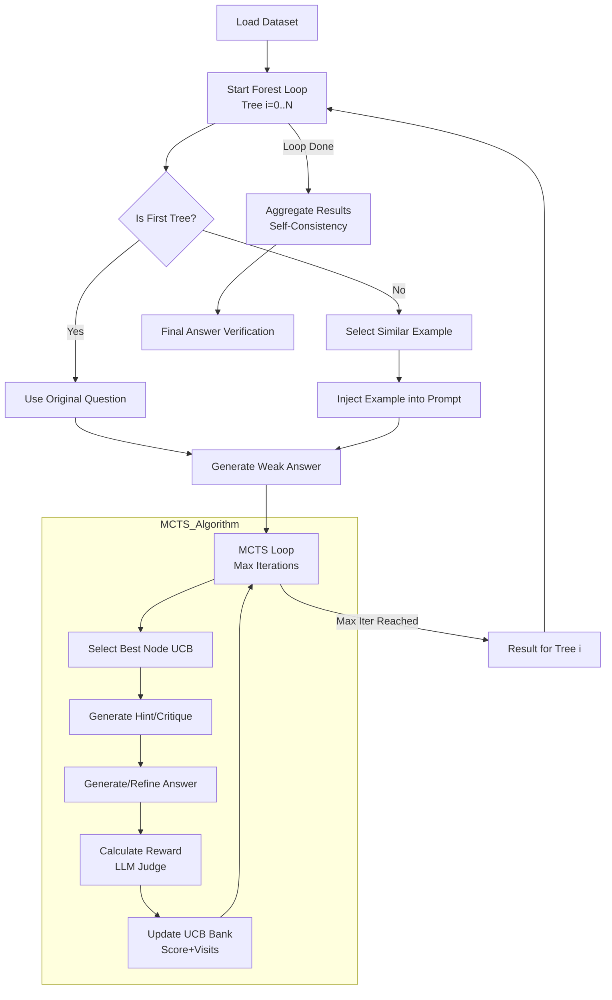
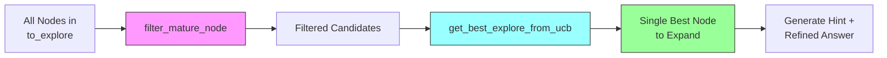

# Forest-of-Thought: Detailed Workflow

This document traces the complete execution flow of the MCTS algorithm, showing each step, function call, file location, and the exact prompts sent to the LLM.

---

## Overview



---

## Step-by-Step Execution

### **Step 1: Load Dataset**

**File**: [run_with_mcf.py](file:///Users/admin/Documents/Forest-of-Thought/run_with_mcf.py) (Line ~628)
```python
dataset = mcts_load_data(args)
# Loads: datasets/gsm8k/test.parquet
```

**Example Problem**:
```json
{
  "question": "Janet's ducks lay 16 eggs per day...",
  "answer": "#### 18"
}
```

---

### **Step 2: The Forest Loop (Input Diversity)**

**File**: [run_with_mcf.py](file:///Users/admin/Documents/Forest-of-Thought/run_with_mcf.py) (Inside [run](file:///Users/admin/Documents/Forest-of-Thought/run_with_mcf.py#249-311) method of [Monte_Carlo_Forest](file:///Users/admin/Documents/Forest-of-Thought/run_with_mcf_stop_noearly.py#314-600), Lines ~355-365)

The system runs **multiple trees** (`tree_nums`, e.g., 5) for the *same* problem to explore different reasoning paths.

1.  **Tree 0**: Uses the original question only.
2.  **Tree 1+**: Injects a "similar" solved example from the bank to guide the model's reasoning style (Input Diversity).

```python
# run_with_mcf.py
for t in range(self.tree_nums):
    if t > 0:
        # Find closest example from utils/examples.py
        # Uses TF-IDF + Cosine Similarity
        case = self.learning_cases[query_index] 
        # Modifies prompt: "Question: [Example] Answer: [Example] ... Question: [Target]"
        query = ... 
    
    # Run independent MCTS for this tree
    monte_carlo_tree(...)
```

**Helper Function**: [get_similarity_question](file:///Users/admin/Documents/Forest-of-Thought/utils/examples.py#217-234)
**File**: [utils/examples.py](file:///Users/admin/Documents/Forest-of-Thought/utils/examples.py) (Lines 217-234)
*   **Logic**: Uses TF-IDF and Cosine Similarity to find the "closest" example in the bank.
*   **Key Behavior**: Even if no good match exists, it *always* returns the mathematical nearest neighbor to ensure the prompt is perturbed, adding diversity.

---

### **Step 3: Generate Initial "Weak" Answer**

**Function**: [get_weak_answer()](file:///Users/admin/Documents/Forest-of-Thought/run_with_mcf.py#62-68)
**File**: [run_with_mcf.py](file:///Users/admin/Documents/Forest-of-Thought/run_with_mcf.py) (Lines 64-67)

**Prompt Sent to LLM**:
```
Question: Janet's ducks lay 16 eggs per day...

The response should begin with [reasoning process]...[Verification]... and end with "[Final Answer] The answer is [answer] 
#### [answer]"

Let's think step by step.
```

**LLM Response (Example)**:
```
[reasoning process]
Janet starts with 16 eggs...
9 × $2 = $18

[Verification]
9 × 2 = 18 ✓

[Final Answer] The answer is 18
#### 18
```

**Score**: [cal_reward()](file:///Users/admin/Documents/Forest-of-Thought/run_with_mcf_stop_noearly.py#35-50) is called immediately after to score this initial node (see Step 4.4).

---

### **Step 4: MCTS Iteration Loop**

**Function**: [monte_carlo_tree](file:///Users/admin/Documents/Forest-of-Thought/run_with_mcf_stop_noearly.py#223-313)
**File**: [run_with_mcf.py](file:///Users/admin/Documents/Forest-of-Thought/run_with_mcf.py) (Lines ~130-180)

**For each iteration** (0 to `max_iter-1`):

#### **4.1: Selection** - Pick Best Node Using UCB

**Function**: [get_best_explore_from_ucb()](file:///Users/admin/Documents/Forest-of-Thought/run_with_mcf.py#89-101)
**File**: [run_with_mcf.py](file:///Users/admin/Documents/Forest-of-Thought/run_with_mcf.py) (Lines ~388-406, defined outside class or as helper)

```python
# Calculate UCB for each node:
UCB = reward + 1.4 × √(log(parent_visits) / node_visits)
# Balances exploitation (high reward) and exploration (low visits)
# Returns: The best node to expand
```

#### **4.2: Generate Hint/Critique**

**Function**: [get_weak_hints()](file:///Users/admin/Documents/Forest-of-Thought/run_with_mcf.py#69-72)
**File**: [run_with_mcf.py](file:///Users/admin/Documents/Forest-of-Thought/run_with_mcf.py) (Lines 55-57)

**Prompt Sent to LLM**:
```
Question: [Question]
Answer: [Selected Answer]

Since we have a weak Answer, could you provide me with a reflection or feedback to correct this answer better? Analyze this Answer Strictly and Critic, point out every flaw for every possible imperfect to minus every possible score!

Let's think step by step.
```

**LLM Response (Hint)**:
```
The calculation looks correct, but let me verify each step more carefully...
```

#### **4.3: Generate Better Answer**

**Function**: [get_better_answer()](file:///Users/admin/Documents/Forest-of-Thought/run_with_mcf_stop_noearly.py#59-62)
**File**: [run_with_mcf.py](file:///Users/admin/Documents/Forest-of-Thought/run_with_mcf.py) (Lines 59-61)

**Prompt Sent to LLM** (includes conversation history with hint):
```
[Previous conversation history including the hint above]

Question: [Question]

Please refine your answer according to your Reflection or Feedback. The response should begin with [reasoning process]...[Verification]...

Let's think step by step.
```

**LLM Response (Refined Answer)**:
```
[reasoning process]
Let me solve this step-by-step with clear order of operations...
[Final Answer] The answer is 18
#### 18
```

#### **4.4: Calculate Reward Score**

**Function**: [cal_reward()](file:///Users/admin/Documents/Forest-of-Thought/run_with_mcf_stop_noearly.py#35-50)
**File**: [run_with_mcf.py](file:///Users/admin/Documents/Forest-of-Thought/run_with_mcf.py) (Lines 35-49)

**Prompt Sent to LLM**:
```
Question: [Question]
Answer: [Refined Answer]

Analyze this Answer Strictly and Critic...
Output a score between [0,100], i.e. from 0 to 100.
```

**LLM Response**: `[Analyst]...[Score] 95/100` -> Extracted as **95**

#### **4.5: Update UCB Values**

**Function**: [update_ucb()](file:///Users/admin/Documents/Forest-of-Thought/run_with_mcf.py#105-143)
**File**: [run_with_mcf.py](file:///Users/admin/Documents/Forest-of-Thought/run_with_mcf.py) (Lines ~408-433)

```python
# Update visits and rewards for the node and its ancestors
# Recalculate UCB scores for future selections
```

---

### **Step 4.6: Sparse Activation Strategy**

> [!IMPORTANT]
> **Sparse Activation** is a core efficiency mechanism in FoT that selectively activates only the most promising reasoning paths, rather than exhaustively exploring all branches.

The sparse activation strategy consists of three key components:

#### **4.6.1: Filter Mature Nodes**

**Function**: [filter_mature_node()](file:///Users/admin/Documents/Forest-of-Thought/run_with_mcf_stop_noearly.py#142-150)
**File**: [run_with_mcf_stop_noearly.py](file:///Users/admin/Documents/Forest-of-Thought/run_with_mcf_stop_noearly.py) (Lines 142-150)

This function implements **pruning** by filtering out nodes that have been sufficiently explored:

```python
def filter_mature_node(childs, to_explore, to_explore_reward, max_expand=3):
    filterd_to_explore = []
    avg_reward = {node: (min(to_explore_reward[node]) + np.mean(to_explore_reward[node])) / 2 
                  for node in to_explore}

    for node in to_explore:
        # Keep node if:
        # 1. It has fewer than max_expand children (not fully expanded), OR
        # 2. All its children have lower avg reward (worth exploring more)
        if len(childs.get(node,[])) < max_expand or \
           max([avg_reward.get(child,-999) for child in childs.get(node,[])]) < avg_reward.get(node,-999):
            filterd_to_explore.append(node)
    
    return filterd_to_explore
```

**Key Parameters**:
| Parameter | Default | Purpose |
|-----------|---------|---------|
| `max_expand` | 3 | Maximum children per node before considered "mature" |

#### **4.6.2: UCB-Based Selection**

**Function**: [get_best_explore_from_ucb()](file:///Users/admin/Documents/Forest-of-Thought/run_with_mcf_stop_noearly.py#153-165)
**File**: [run_with_mcf_stop_noearly.py](file:///Users/admin/Documents/Forest-of-Thought/run_with_mcf_stop_noearly.py) (Lines 153-165)

After filtering, this function selects the **single best node** to expand:

```python
def get_best_explore_from_ucb(to_explore, ucb_bank):
    best_node = None
    highest_ucb = float('-inf')
    
    for node in to_explore:
        ucb_value = ucb_bank.get(node, float('-inf'))
        if ucb_value > highest_ucb:
            highest_ucb = ucb_value
            best_node = node
            
    return best_node
```

#### **4.6.3: UCB Score Computation**

**Function**: [compute_ucb()](file:///Users/admin/Documents/Forest-of-Thought/run_with_mcf_stop_noearly.py#168-169)
**File**: [run_with_mcf_stop_noearly.py](file:///Users/admin/Documents/Forest-of-Thought/run_with_mcf_stop_noearly.py) (Lines 168-169)

The UCB (Upper Confidence Bound) formula balances **exploitation** (high reward nodes) and **exploration** (less-visited nodes):

```python
def compute_ucb(r_c, N_n, N_c, C):
    return r_c + C * math.sqrt(math.log(N_n + 1) / (N_c + 1e-5))
```

**Formula Breakdown**:
```
UCB = reward + C × √(log(parent_visits + 1) / (node_visits + ε))
      ──────   ─────────────────────────────────────────────────
      exploit                    explore
```

| Variable | Meaning |
|----------|---------|
| `r_c` | Average reward of the node |
| `N_n` | Visit count of parent node |
| `N_c` | Visit count of current node |
| `C` | Exploration constant (default: 1.4) |
| `ε` | Small constant (1e-5) to prevent division by zero |

#### **Sparse Activation Flow in MCTS**



**Code in** [monte_carlo_tree()](file:///Users/admin/Documents/Forest-of-Thought/run_with_mcf_stop_noearly.py#287-310) (Lines 287-310):

```python
for i in range(max_iter):
    # 1. SPARSE ACTIVATION: Filter mature nodes
    filterd_to_explore = filter_mature_node(childs, to_explore, to_explore_reward)
    
    # 2. SPARSE ACTIVATION: Select ONLY the best node (not all nodes)
    weak_answer = get_best_explore_from_ucb(filterd_to_explore, ucb_bank)
    
    # 3. Simulate: Sample reward for selected node
    sampling_reward(weak_answer)
    
    # 4. Expand: Generate hint and refined answer for ONLY this node
    hints, answer, history = step(query, weak_answer, ...)
    
    # 5. Update tree structure
    fathers[answer] = weak_answer
    childs[answer] = []
    add_to_childs(weak_answer, answer)
    
    # 6. Backpropagate UCB values
    update_ucb(...)
```

> [!TIP]
> **Why Sparse Activation Matters**: Instead of expanding all frontier nodes (exponential growth), FoT only expands **one carefully selected node** per iteration. This makes the algorithm scale linearly with `max_iter` while still finding high-quality solutions.

---

### **Step 5: Select Best Answer from Tree**

**Function**: [get_tree_ans](file:///Users/admin/Documents/Forest-of-Thought/run_with_mcf_stop_noearly.py#212-222) / Weighted Score Logic
**File**: [run_with_mcf.py](file:///Users/admin/Documents/Forest-of-Thought/run_with_mcf.py) (Lines 212-221)

After the loop, the absolute best answer *for this specific tree* is selected.

```python
# Weighted Score = 0.5*MinReward + 0.3*Visits + 0.2*UCB
best_answer = max(answers_list, key=weighted_score)
```

---

### **Step 6: Aggregate Results (Forest Level)**

**File**: [run_with_mcf.py](file:///Users/admin/Documents/Forest-of-Thought/run_with_mcf.py) (Inside `monte_carlo_forest.run` loop)

After running all `tree_nums` trees, the code collects all [tree_ans](file:///Users/admin/Documents/Forest-of-Thought/run_with_mcf_stop_noearly.py#212-222) (best answer from each tree).

*   *Note: In the provided code, `is_correct` logic seems to check each tree individually, but a robust Forest implementation would typically take a majority vote here.*

---

### **Step 7: Verify Correctness**

**Function**: [check()](file:///Users/admin/Documents/Forest-of-Thought/utils/utils.py#241-303)
**File**: [utils/utils.py](file:///Users/admin/Documents/Forest-of-Thought/utils/utils.py) (Lines 238-300)

**Logic**:
```python
# Extract and compare canonical answers
if extract_label(answer) == extract_label(ground_truth):
    return True
```

**Console Output**:
```
18 18
correct_num=1, current_num=1
```

---

## Summary Table of Key Files

| Aspect | File | Key Functions |
|--------|------|---------------|
| **Main Logic** | [run_with_mcf_stop_noearly.py](file:///Users/admin/Documents/Forest-of-Thought/run_with_mcf_stop_noearly.py) | [Monte_Carlo_Forest](file:///Users/admin/Documents/Forest-of-Thought/run_with_mcf_stop_noearly.py#314-600), [monte_carlo_tree](file:///Users/admin/Documents/Forest-of-Thought/run_with_mcf_stop_noearly.py#223-313), [step](file:///Users/admin/Documents/Forest-of-Thought/run_with_mcf_stop_noearly.py#207-210) |
| **Sparse Activation** | [run_with_mcf_stop_noearly.py](file:///Users/admin/Documents/Forest-of-Thought/run_with_mcf_stop_noearly.py) | [filter_mature_node](file:///Users/admin/Documents/Forest-of-Thought/run_with_mcf_stop_noearly.py#142-150), [get_best_explore_from_ucb](file:///Users/admin/Documents/Forest-of-Thought/run_with_mcf_stop_noearly.py#153-165), [compute_ucb](file:///Users/admin/Documents/Forest-of-Thought/run_with_mcf_stop_noearly.py#168-169) |
| **UCB Management** | [run_with_mcf_stop_noearly.py](file:///Users/admin/Documents/Forest-of-Thought/run_with_mcf_stop_noearly.py) | [update_ucb](file:///Users/admin/Documents/Forest-of-Thought/run_with_mcf_stop_noearly.py#171-205), [get_tree_ans](file:///Users/admin/Documents/Forest-of-Thought/run_with_mcf_stop_noearly.py#212-221) |
| **Decision Making** | [run_with_mcf_stop_noearly.py](file:///Users/admin/Documents/Forest-of-Thought/run_with_mcf_stop_noearly.py) | [get_fot_final_answer](file:///Users/admin/Documents/Forest-of-Thought/run_with_mcf_stop_noearly.py#556-599) (CGDM, random, score strategies) |
| **Diversity** | [utils/examples.py](file:///Users/admin/Documents/Forest-of-Thought/utils/examples.py) | [get_similarity_question](file:///Users/admin/Documents/Forest-of-Thought/utils/examples.py#217-234), [get_examples](file:///Users/admin/Documents/Forest-of-Thought/utils/examples.py#8-215) |
| **Reward Scoring** | [run_with_mcf_stop_noearly.py](file:///Users/admin/Documents/Forest-of-Thought/run_with_mcf_stop_noearly.py) | [cal_reward](file:///Users/admin/Documents/Forest-of-Thought/run_with_mcf_stop_noearly.py#35-49) |
| **Model API** | [models/load_local_model.py](file:///Users/admin/Documents/Forest-of-Thought/models/load_local_model.py) | [get_respond](file:///Users/admin/Documents/Forest-of-Thought/models/load_local_model.py#70-124), [get_respond_ollama](file:///Users/admin/Documents/Forest-of-Thought/models/load_local_model.py#125-167) |
| **Utility** | [utils/utils.py](file:///Users/admin/Documents/Forest-of-Thought/utils/utils.py) | [check](file:///Users/admin/Documents/Forest-of-Thought/utils/utils.py#241-303), [extract_label](file:///Users/admin/Documents/Forest-of-Thought/utils/utils.py#202-229) |

---

## Key Algorithm Parameters

| Parameter | Default | Location | Description |
|-----------|---------|----------|-------------|
| `tree_nums` | 2 | CLI args | Number of trees in the forest |
| `max_iter` | 1 | CLI args | MCTS iterations per tree |
| `max_expand` | 3 | `filter_mature_node` | Max children before node is "mature" |
| `C` | 1.4 | `update_ucb` | UCB exploration constant |
| `gamma` | 0.85 | `update_ucb` | Discount factor for backpropagation |
| `stop` | "cgdm" | CLI args | Decision strategy: cgdm, random, majority, score |

---

## Decision-Making Strategies

| Strategy | Description | Code Location |
|----------|-------------|---------------|
| **CGDM** (Consensus-Guided) | Uses majority voting; if tie, asks LLM expert to select best | [get_fot_final_answer](file:///Users/admin/Documents/Forest-of-Thought/run_with_mcf_stop_noearly.py#556-599) |
| **Random** | Randomly selects from candidate answers | Lines 587-588 |
| **Score** | Selects answer with highest reward score | Lines 589-598 |
| **Majority** | Simple majority voting | (not implemented in current code) |

